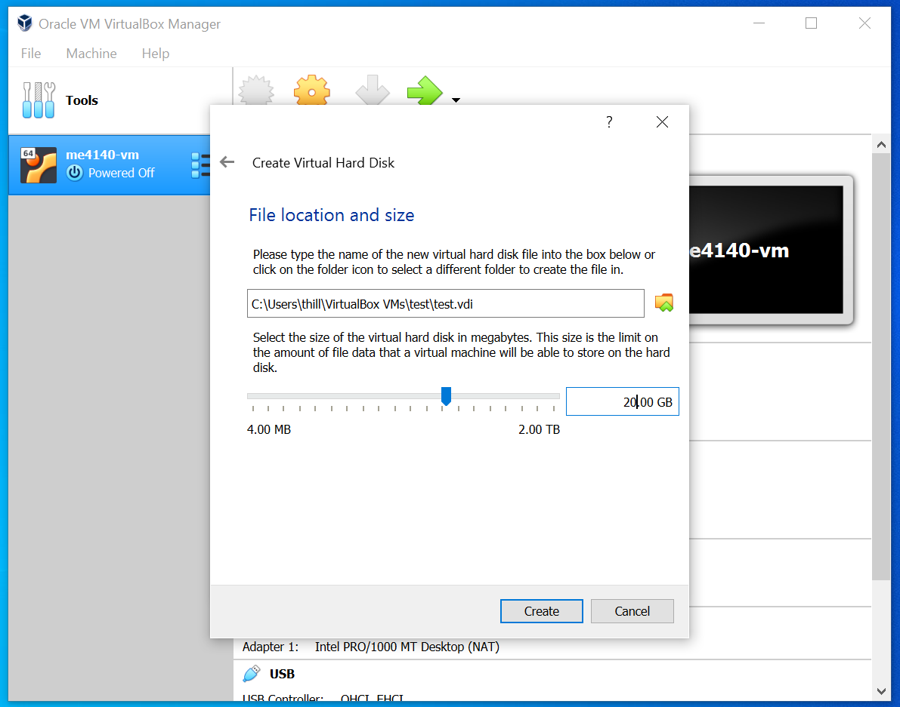

 # ME4140 - Introduction to Robotics - Fall 2021

# ROS Workshop - Tutorial 1 - Virtualize Ubuntu

## Overview

In this tutorial you will first download and install VirtualBox from Oracle which is an application for _virtualizing_ operating systems inside of an existing one. Next, you will download the Ubuntu installation .iso file and setup a virtual operating system for learning ROS.  After completing this exercise, you will be ready to install the ROS Melodic software package in Ubuntu which is described in detailed in the next module.

## What is a [Virtual Machine](https://en.wikipedia.org/wiki/Virtual_machine) ?
- A virtual machine is an operating system that is installed or _virtualized_ inside another operating system.
- This is useful for learning and testing, but it is resource intensive and is not ideal for permanent use. 
- [VirtualBox](https://www.virtualbox.org/) is a trusted application from Oracle widely used for this process. [VMware](https://www.vmware.com/) is alternative option for virtualization, but it will not be supported in this course.

## System Requirements
- *CPU:* Most modern notebook or desktop computers will work well. If you are using a very old computer it may be very slow. A tablet or Chromebook is not supported.
- *Memory:* At least 8Gb of RAM is recommended.        
- *Storage:* Approximately 20Gb of free space on a hard drive is required. This space will remain in its current partition, and you are free to delete the files later. USB 2.0 or slower connection to the hard drive is not recommended. 
- *GPU:* A dedicated graphics prcocessing unit is *not required*. This process has been tested with Intel embedded graphics.

## Before You Begin
- It is a good idea to back up any important files before you begin a project. Hard disk drives fail. Solid state drives can also fail. 
- Some students may have to adjust a computer BIOS setting to allow virtualization. This setting can be easily reverted after completing the workshop.   
- It is recommended to have your computer's power supply plugged-in before you begin this installation process.

## Detailed Setup Process

### Part 1 - Install VirtualBox Application

- Download the VirtualBox installation file using the link on ilearn. Choose the link that matches your computer type. If you are using a Linux computer already you do not need this tutorial. 
    
- Click the VirtualBox installation file you downloaded and install the application. You will need to provide admistrator access and click allow. You no longer need the installation file, but it is small so it wont hurt to keep it. 

### Part 2 - Virtual Machine Configuration
Before proceeding make sure you have an internet connection and access to a power supply or battery.

#### Open the VirtualBox application installed in Part 2

#### Create New Virtual Machine

Click the {\bf new} button.

#### Define Basic Settings

- choose a *computer name* (this is your choice but remember it!)
- choose an *operating system* type (Linux)
- choose a *version*, this depends on your physical machine - probably Ubuntu 64-bit 
- click *next*

#### Define Virtual Machine Parameters

- Choose the amount of RAM you want to allocate to the VM  
- More is better but you must leave some RAM for the host operating system (Windows or Mac). If your computer has 8GB total I suggest no more than 6GB for for the virtual machine. If your host machine has 16GB, then 10Gb is reccomended for the VM.
- click *next*

#### Define Virtual Hard Drive Parameters

 - choose *create a virtual hard drive now*
 - click *create*

#### Virtual Hard Drive Setup

 - choose the virtual hard drive type, _VDI_ is the recommended type. 
 - click *next*

#### Virtual Hard Drive Setup (continued)

- choose *Fixed Size* virtual hard drive. 
- click *next*

#### Virtual Hard Drive Setup (continued)

- choose the size of your virtual hard drive       
- to virtualize Ubuntu and install ROS it is recommended to make a 20 GB VDI if you have space
- click *create*
          
### Part 3 - Ubuntu OS Installation and Setup
