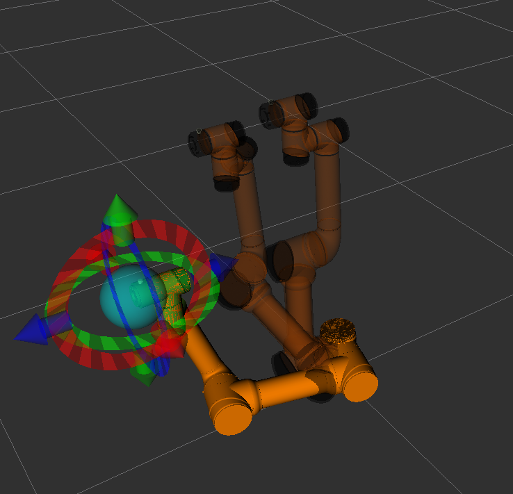
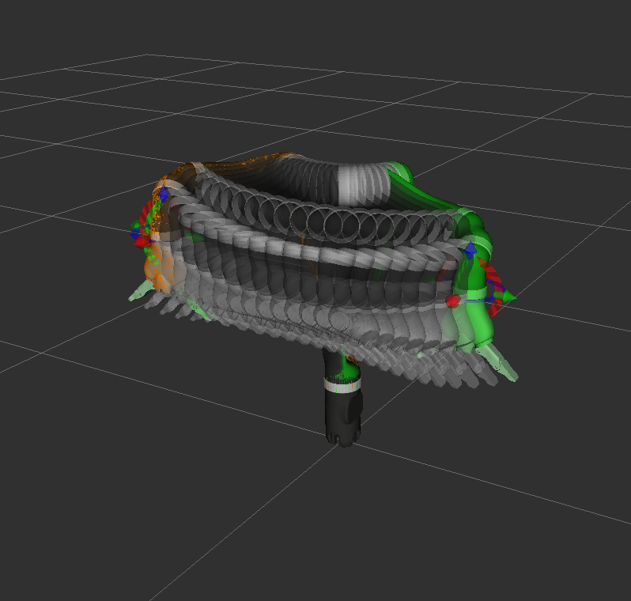

# Tutorial 11 - Using moveit

This is my notes for using moveit with ROS. I can't quite call it a tutorial yet.

This module should switch places with the next module. 10 should be 11 and 11 should be 10

## ROS Version

This was the `melodic` branch, but it needs to be updated and tested with `noetic` 

Select the version of ROS by choosing the appropriate repository branch.


## Resources

Read the docs! It looks like they are in two places...

 - [moveit](https://moveit.ros.org/)

 - [moveit_tutorials](http://docs.ros.org/en/melodic/api/moveit_tutorials/html/doc/getting_started/getting_started.html#install-ros-and-catkin) 

 - [Stephen Zuccaro on Youtube](https://www.youtube.com/channel/UCofPudSKrNzT3vccJD6VDyA)


## Installation

This has been tested on Ubuntu 18.04 (minimal) in a VM (see module 1)

It is assumed that [ROS melodic](http://wiki.ros.org/melodic/Installation/Ubuntu) is installed 

Source the ROS setup file before starting. This is probably in your `~/.bashrc`

```
source /opt/ros/$ROS_DISTRO/setup.bash
```

### Install Moveit 

Follow the instructions [here](http://docs.ros.org/en/melodic/api/moveit_tutorials/html/doc/getting_started/getting_started.html#install-ros-and-catkin) to install `moveit` with `apt` (aka _binary installation_). The commands are copied here for convenience. The _source installation_ is not needed unless you want to modify the Moveit package.  

Upgrade system

```
rosdep update
sudo apt update
sudo apt upgrade  # tutorial above uses `dist-upgrade` but I do not think that matters
```

Install neccesary packages (These are available in `venv`, test that next)

```
sudo apt install ros-$ROS_DISTRO-catkin python-catkin-tools
```

Install moveit

```
sudo apt-get install ros-$ROS_DISTRO-moveit
```

### Create a workspace for moveit

This will be a `catkin build` workspace, but `catkin_make` should work also.

```
mkdir -p ~/catkin_build_ws/src
```

Prepare the workspace and compile with `catkin build`. Read about `catkin_build` in the [catkin_tools docs](https://catkin-tools.readthedocs.io/en/latest/verbs/catkin_build.html)

```
cd ~/catkin_build_ws
rosdep install -y --from-paths . --ignore-src --rosdistro $ROS_DISTRO
catkin config --extend /opt/ros/${ROS_DISTRO} --cmake-args -DCMAKE_BUILD_TYPE=Release

catkin build
```
After compiling, source the workspace setup file. 

```
source ~/catkin_build_ws/devel/setup.bash
```
Put this in `~/.bashrc` for convinience. This is optional but reccomended.
```
echo "source ~/catkin_build_ws/devel/setup.bash" >> ~/.bashrc
```

### Import a robot from URDF

Import a robot of your choice. At minimum the model .stl files and a robot .urdf (Universal Robot Descriptor File) are required. This example uses the _Aubo i5_ from [AuboRobot](https://github.com/AuboRobot/aubo_robot)

Clone the `aubo_robot` package into a temporary location like `~/Downloads`. It will not compile in ROS melodic, so the full package should not be in `ws_moveit`. Also, the `UpdateMoveitLib` patch is not reccommend because it modifies the system wide libraries in an unknown and non-standard way. Don't bork the deps!

```
cd ~/Downloads
git clone https://github.com/AuboRobot/aubo_robot.git -b $ROS_DISTRO
```

Copy the `aubo_description` package from inside the `aubo_robot` package into the `ws_moveit`. (`-r` is the recursive flag for copying directories )

```
cp -r ~/Downloads/aubo_robot/aubo_description ~/catkin_build_ws/src/aubo_description
```

The `aubo_description` package must be in an workspace that it can be found by the `moveit setup assistant`. Verify that your workspace compiles, and then source the workspace setup files so that changes are recognized.

```
cd ~/catkin_build_ws
catkin build
source devel/setup.bash
```

### Generate a moveit config package with Moveit Setup Assistant

Run the `moveit setup assistant` from the [tutorial](http://docs.ros.org/en/melodic/api/moveit_tutorials/html/doc/setup_assistant/setup_assistant_tutorial.html)  
```
roslaunch moveit_setup_assistant setup_assistant.launch
```

Complete steps 1-12 to generate a Gazebo compatible URDF from the URDF in the aubo package. Follow the instructions in the tutorial above.

I used the the file `/catkin_build_ws/aubo_description/urdf/aubo_i5.urdf` to generate the urdf `aubo_i5_gazebo.urdf` and a package named `aubo_i5_moveit_config`


Create a directory in the new package for the gazebo urdf that you copied during _Step 9: Gazebo Simulation_ .

```
mkdir ~/catkin_build_ws/src/aubo_i5_moveit_config/gazebo
gedit ~/catkin_build_ws/src/aubo_i5_moveit_config/gazebo/aubo_i5_gazebo.urdf
```

Paste in the urdf XML from the clipboard and save the file. If you lost the data on the clipboard, you do not have to start over. Launch the setup assistant again, and choose `edit existing configuration`. Load the config package you made and go get the XML again.  


Compile the package with catkin build. The new moveit config package should compile without errors.

```
cd ~/catkin_build_ws
catkin build

source devel/setup.bash
```

### Test newly created moveit config package 

#### Test 1 - Gazebo Import 

Now start the Gazebo simulator with an empty world

```
roslaunch gazebo_ros empty_world.launch paused:=true use_sim_time:=false gui:=true throttled:=false recording:=false debug:=true
```

Add the robot to the simulator using the urdf for gazebo. This should be improved with `find` or something similar. 

```
rosrun gazebo_ros spawn_model -file ~/catkin_build_ws/src/aubo_i5_moveit_config/gazebo/aubo_i5_gazebo.urdf -urdf -x 0 -y 0 -z 1 -model aubo_i5
```

It looks like it worked. Woop Woop! 


I tried to go through the same process with the Jaco arm, but the gazebo simulation is not working. The only difference I see is the addition of the fingers as the end effector, but it could be in the xacro/urdf.

```
rosrun gazebo_ros spawn_model -file ~/catkin_build_ws/src/jaco_arm_moveit_config/gazebo/jaco_arm_gazebo.urdf -urdf -x 0 -y 0 -z 1 -model jaco_arm

[INFO] [1638849286.552341]: Loading model XML from file /home/thill/catkin_build_ws/src/jaco_arm_moveit_config/gazebo/jaco_arm_gazebo.urdf
[ERROR] [1638849286.558107]: Invalid XML: junk after document element: line 693, column 0

```

#### Test 2 - RVIZ Demo

The `aubo_i5_moveit_config` package contains a collection of launch files. The example `demo.launch` displays the robot in RVIZ and allows the user to plan and execute arm motions using the the Moveit panel.

```
roslaunch aubo_i5_moveit_config demo.launch
```

 

Configure the display menu to show the start and goal locations by selecting _Planning Requests > Query Start State_ in the displays menu on the left.

 

Choose the the start and goal locations by dragging the end effector to the desired position. Animate the robot by pressing _plan_ or _plan and execute_ in the Moveit panel on the bottom left.

 

Show the intermediate poistions by selecting _Planned Path > Show Trail_, and disable the infinite loop by deselecting _Planned Path > Loop Animation_. The settings are described in more detail in the Moveit [getting started](http://docs.ros.org/en/melodic/api/moveit_tutorials/html/doc/getting_started/getting_started.html) tutorial.

 
I have tested the same workflow with one of the 6DOF Jaco arms from `kinova-ros`. 

```
roslaunch jaco_arm_moveit_config demo.launch
```

 

 


This works, but the database needs to be setup to save the start and goal states. 

 


### Setting up MongoDB for storing planning states

#### Install MongoDB for Ubuntu18 

I followed the install instructions for ubuntu 18 [here](https://docs.mongodb.com/manual/tutorial/install-mongodb-on-ubuntu/). The commands are shown below for convience. All steps executed without errors or warnings on my system.

##### Import public keys

```
wget -qO - https://www.mongodb.org/static/pgp/server-5.0.asc | sudo apt-key add -
```

##### Create list file for MongoDB

```
echo "deb [ arch=amd64,arm64 ] https://repo.mongodb.org/apt/ubuntu bionic/mongodb-org/5.0 multiverse" | sudo tee /etc/apt/sources.list.d/mongodb-org-5.0.list
```

##### Update the ubuntu package list

```
sudo apt update
```

##### Install MongoDB packages

```
sudo apt install mongodb-org
```

##### Initialize MongoDB database

```
sudo systemctl start mongod
```

If you want the database to initialize following a ubuntu reboot

```
sudo systemctl enable mongod
```


##### Verify the database has started

```
sudo systemctl status mongod
```

The following output should be shown.
``` 
● mongod.service - MongoDB Database Server
   Loaded: loaded (/lib/systemd/system/mongod.service; disabled; vendor preset: enabled)
   Active: active (running) since Mon 2021-12-06 23:08:56 CST; 36min ago
     Docs: https://docs.mongodb.org/manual
 Main PID: 5475 (mongod)
   CGroup: /system.slice/mongod.service
           └─5475 /usr/bin/mongod --config /etc/mongod.conf

Dec 06 23:08:56 ubuntu18-vm1 systemd[1]: Started MongoDB Database Server.
```

##### If needed, stop the database

```
sudo systemctl stop mongod
```

##### If needed, restart the database

```
sudo systemctl restart mongod
```

#### Install the ros wrapper package for MongoDB

```
sudo apt install ros-melodic-warehouse-ros-mongo
```
This also ran as expected.

#### Finally, test the MongoDB database with Moveit

Run `demo.launch` with the `db:=true` option.

```
roslaunch jaco_arm_moveit_config demo.launch db:=true
```

In the _MotionPlanning_ window, select the _Context_ tab on the left and click _Connect_. Select _yes_ to clear all states.

 

The _Connect_ button should change to _Disconnect_. The database is now connected. 

 

Select the _Stored States_ tab on the far right of the _MotionPlanning_ window. You should be able to use the _Save Start_ and _Save Goal_ buttons to store arm positions in the database. 

 

Close rviz and relaunch the demo with the `db:=true` option. Repeat the connection procedure in the _Context_ tab. Now, back in the _Stored States_ tab you can recall the arm positions by choosing the saved states shown on the left and clicking the _Set as Start_ and _Set as Goal_ buttons. The arm should move to the stored positions, and motion planning should work. Woop Woop!


