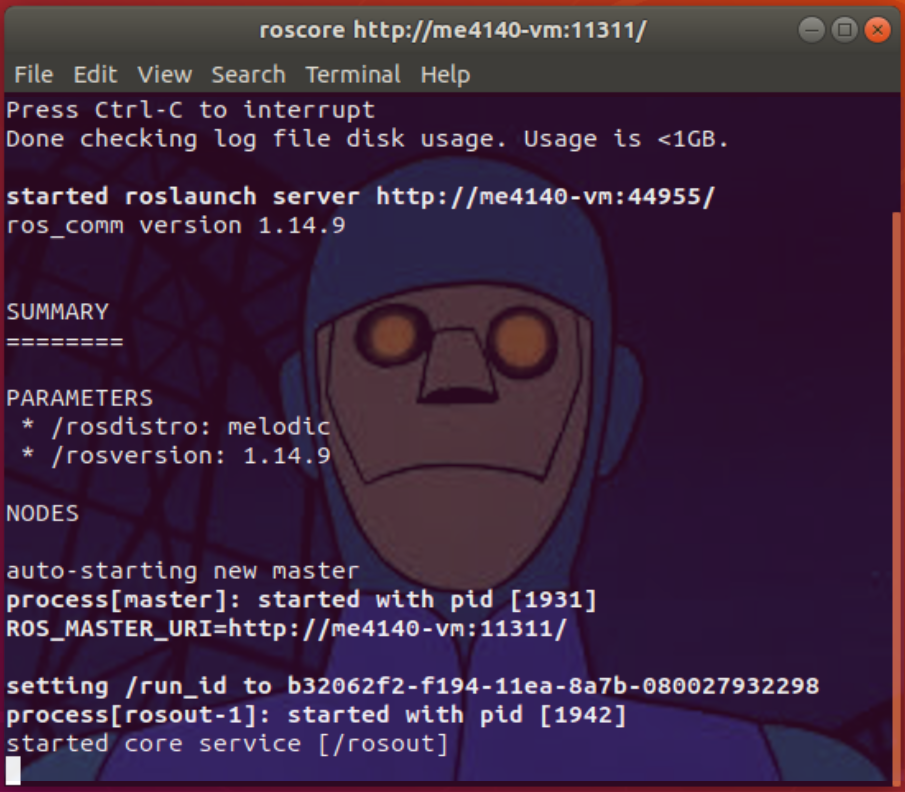

# ROS Workshop - Tutorial 2 - Install ROS
## ME4140 - Introduction to Robotics, ME6640 - Advanced Robotics

## Overview

After completing _Tutorial 1 - Virtualize Ubuntu_, your new operating system is running, and you are ready to install ROS. You can read more about the installation [here](http://wiki.ros.org/melodic/Installation/Ubuntu}{here}) on the ROS wiki.

## System Requirements
- **OS:** This tutorial is intended for the Ubuntu 18.04 LTS operating system. Alternate flavors of 18.04 (i.e. - Mint, Mate, kbuntu) may work but have not been tested.
- **Internet:** Your computer must be connected to the internet to proceed. Downloading and installing ROS may take approximately 15 to 30 minutes . 

## Before You Begin
- **Copy and Paste Errors:** It is strongly recommended to use copy and paste to enter the commands in this tutorial, but this will not work correctly in the ilearn PDF viewer. Use the tutorial webpage or download the PDF to copy the commands directly.
- **Backup:** If you are using a virt1ual machine, it is recommend to make a snaphot of your virtual machine before begining this tutorial. See _Tutorial 1 - Virtualize Ubuntu_ for details.

## Installation Instructions

The following commands must be entered into the Ubuntu terminal. Press CTRL+ALT+T to open a new terminal, then carefully copy each command and paste it into the terminal then press ENTER. **The terminal commands are shown `formatted as commands`.**


### Step 1.1 - Configure your Ubuntu repositories (The default settings are fine)
### Step 1.2 - Setup your sources.list to accept software from packages.ros.org

```
sudo sh -c 'echo "deb http://packages.ros.org/ros/ubuntu $(lsb_release -sc) main" > /etc/apt/sources.list.d/ros-latest.list'
```
### Step 1.3 - Set up your keys used to authenticate software packages for security

```
sudo apt install curl # if you haven't already installed curl
```

```
curl -s https://raw.githubusercontent.com/ros/rosdistro/master/ros.asc | sudo apt-key add -
```

### Step 1.4 - Install the ROS package

Update the package list before intalling ROS.
```
sudo apt update
``` 

Choose the **Desktop-Full Install: (Recommended)** option to install the **-Full** package.

```
sudo apt install ros-melodic-desktop-full
```

### Step 1.5 - Complete the environment setup.

Choose the `bash` option unless you already know about `zsh`.

Append a single line to the text file `~/.bashrc`

```
echo "source /opt/ros/melodic/setup.bash" >> ~/.bashrc
```

```
source ~/.bashrc
```
### Step 1.6 - Install the Developer Packages

Install a list of package

```
sudo apt install python-rosdep python-rosinstall python-rosinstall-generator python-wstool build-essential
```

Intitialize the package rosdep
```
sudo rosdep init
```

```
rosdep update
```

### Test the Installed Package

Close all terminals. Open a new terminal and enter the following command.

```
roscore
```

If the installation was successful, the terminal output will be _similar_ to the image below.



Abort the roscore process by clicking in the terminal and pressing CTRL + C then close the terminal window. Congratulations, you have installed ROS Melodic.

## Tutorial Complete:

Congratulations you have installed ROS.


