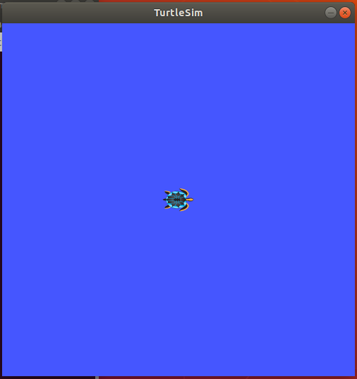

# ME4140 - Introduction to Robotics - Fall 2021

# ROS Workshop - Tutorial 3 - Turtlesim Testdrive

## Overview
After completing _Tutorial 2 - Install ROS_ , your system is setup. You are ready to begin with Turtlesim, a simplistic robot model and simulator that serves as the _Hello World of ROS_. You can read more about turtlesim [here](http://wiki.ros.org/turtlesim) the ROS wiki. 

## System Requirements
**ROS+OS:** This tutorial is intended for a system with ROS Melodic installed on the Ubuntu 18.04 LTS operating system. Alternate versions of ROS (i.e. - Kinetic, Noetic, etc.) may work but have not been tested. Versions of ROS are tied to versions of Ubuntu.
**Internet:** Your computer must be connected to the internet to proceed. Downloading and installing the turtlesim package will only take a few minutes

## Disclaimer

- **Copy and Paste Errors:** Be careful if you use copy and paste for commands. Make sure to copy the entire command.
    
- **Practice with the Terminal:** The commands in this tutorial are relatively short, and it may help improve understanding to type them manually. Press **Tab** for _auto-completion_.
    
## Installation Instructions

Press **Ctrl+Alt+t** to open a new terminal, then carefully enter each command into the terminal then press **Enter**. The terminal commands are shown in gray boxes. _You will have multiple terminals open at once during this tutorial_. 

### Update your Ubuntu package list. 

It is recommended to do this before you install something new.

```
sudo apt update
```
### Install `turtlesim` package for ROS Melodic
Also, install a keyboard controller node `teleop-twist-keyboard`. This will take a few moments. 

```
sudo apt install ros-melodic-turtlesim ros-melodic-teleop-twist-keyboard
```

The terminal will show if the installations were successfully, and it will indicate if the packages were previously installed (turtlesim came with ros-melodic-desktop-full).

## Turtlesim Testdrive

Now, test the newly installed simulator. This exercise is simple, but the process is important. 

### Step 1 - roscore

Start the roscore in a terminal. Leave this process running and this window open. 

```
roscore
```	

### Step 2 - Turtlesim Robot Node

Open a second tab (ctrl+shift+t), and start a node `turtlesim_node` from the package `turtlesim` in the new terminal tab. Leave this process running and this tab open.

```
rosrun turtlesim turtlesim_node
```

### Step 3 - Keyboard Controller Node
Open a third terminal tab and run the keyboard controller node. Now, there should be three open tabs each running a different process.

```
rosrun teleop_twist_keyboard teleop_twist_keyboard.py
```




### Issue! - Communication Disconnect

The turtle is not responding to the keyboard commands. The turtle is stuck! 

The nodes are not communicating because the turtlesim node is not subscribing the to topic published by the keyboard node.

### Troubleshoot 

#### rostopic
Use the `rostopic` tool to to invesitage the topics published be the nodes _while the system is running_. 

| List available topics | Print info about <TOPIC> | Print data from <TOPIC> |
|-----------------------|--------------------------|-------------------------|
| `rostopic list`       |`rostopic info <TOPIC>`   |`rostopic echo <TOPIC>`  |                 

Replace `<TOPIC>` with the name of an avaialable topic. An example is shown below.

First, list the available topics.
```
rostopic list
```

Print data from the `/cmd_vel` topic to verify that the keyboard is publishing commands.
```
rostopic echo /cmd_vel
```
Press `Ctrl+c` in the terminal to stop the 

Print info about different topics. Notice this first topic is published by the keyboard.
```
rostopic info /cmd_vel
```

```
rostopic info /turtle1/cmd_vel
```

Look at the output of the `info` commands. Do you the communication disconnection? 

#### rqt-graph

Use the `rqt-graph` tool to visualize the publisher subscriber connections.
```
rosrun rqt-graph rqt-graph
```

### Solution

Abort the keyboard node by clicking in the third tab and pressing `Ctrl+c`. Then append the following option to the end of the keyboard node command and rerun the command. Now, the keyboard node can communicate with the turtle node.

```
cmd_vel:=turtle1/cmd_vel 
```

### Step 4 - Testdrive!

Move the turtlesim window to the side, and select the keyboard terminal to drive using the following keys. **I** **J** **K** **L**, and **,**  

Drive your turtle around the window and save an image of the window showing the turtle and the path. Can you drive a better ROS than shown in this picture? 

