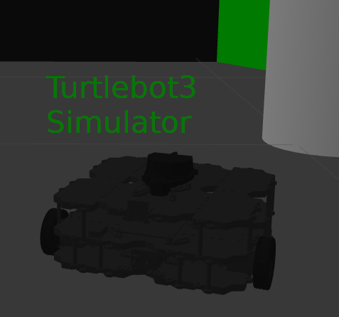

# ROS Workshop - Tutorial 5 - Turtlebot3 Simulations
## ME4140 - Introduction to Robotics, ME6640 - Advanced Robotics 



## Overview:
In this tutorial you will learn to use a 2D robot navigation with Turtlebot3 Simulator in ROS. You can read more about the Turtlebot3 [here](https://www.turtlebot.com/) and [here](https://emanual.robotis.com/docs/en/platform/turtlebot3/overview/).
	
## System Requirements:
- ROS+OS: This tutorial is intended for a system with ROS noetic installed on the Ubuntu 20.04 LTS operating system. Use the branch selector above for alternate versions. ROS versions are tied to versions of Ubuntu.
- ROS: Your computer must be connected to the internet to proceed. Update the system before you begin.
- Workspace Setup: You must have successfully setup a catkin workspace (`~/catkin_ws`) in tutorial 4.  

## Before You Begin:
	
- ROSLAUNCH: This tutorial involves using the roslaunch command which runs a multiple of nodes at once as described in the launch file. We will learn more about this later. 
	
## Part 1 - Turtlebot3 Package Installation:

### Step 1 Update Repository List
Update the list of avilable packages before you get started. 
```
sudo apt update
```	
### Step 2 Install Turtlebot3 Packages 
Install the neccessary packages into your ROS system. This tutorial comes from [here](http://emanual.robotis.com/docs/en/platform/turtlebot3/simulation/#simulation).
    	
**turtlebot3**
```
sudo apt install ros-noetic-turtlebot3
```

**turtlebot3_simulations**
```
sudo apt install ros-noetic-turtlebot3-simulations
```

**turtlebot3_gazebo**
```
sudo apt install ros-noetic-turtlebot3-gazebo
```

### Step 3 Test Package Installation
The required packges should now be installed. Test that the packages are recognized in your workspace with the `roscd` command.
```
roscd turtlebot3
```
If the workspace is configured correctly the current directory should change to the location where the `turtlebot3` package was installed. 

## Part 2 - Turtlebot3 Testdrive:

### Step 1 Configure the simulator

The environment variable `TURTLEBOT_MODEL` must be set to define the robot type. Use `echo` to add this line to the `.bashrc` script so you do not have to do it for each terminal. 
``` 
echo "export TURTLEBOT3_MODEL=burger" >> ~/.bashrc
```
Now that run `.bashrc` with `source`. This also runs automatically each time you open a new terminal.	
```	
source ~/.bashrc
```	

### Step 2 - Start the simulator

The following command uses `roslaunch` to configure and run multilple ROS nodes with a single command. The gazebo simulator will open containing the robot in the example environment. 

```	 
roslaunch turtlebot3_gazebo turtlebot3_world.launch
```

Enter the following command in a new terminal to add keyboard control to the system. Test that the keyboard drives the robot. 

``` 
roslaunch turtlebot3_teleop turtlebot3_teleop_key.launch
```

Now turn on the node to produce robot data in the simulated world.  

``` 
roslaunch turtlebot3_gazebo turtlebot3_simulation.launch
```

Open RVIZ to view the data. This is a very useful tool. 	
```
roslaunch turtlebot3_gazebo turtlebot3_gazebo_rviz.launch
```

## Part 3 - Customize the Simulator 

The `turtlebot3_simulations` package installed in Step 1 is not easliy configurable in the default install directory `/opt/ros/noetic`. To customize the simulator, remove the installed package using the package manager and clone a copy of the source code into user workspace `catkin_ws/src`. 

### Step 1 - Install simulator in  user space
Remove the package

```
sudo apt udpate
sudo apt remove ros-noetic-turtlebot3-simulations
```

Clone a copy into the ROS workspace

```
cd ~/catkin_ws/src
git clone https://github.com/ROBOTIS-GIT/turtlebot3_simulations
```

Compile the workspace

```
cd ~/catkin_ws
catkin_make
```

### Step 2 - Configure Gazebo Simulation

Now the launch files and world configuration can be edited by the user. 

The simulated physics can in the background without Gazebo window. Set `gui` to `false` by editing `turtlebot3_simulations/turtlebot3_gazebo/launch/turtlebot3_world.launch`, and the Gazebo window will no longer open.
 
```
<launch>
  <arg name="model" default="$(env TURTLEBOT3_MODEL)" doc="model type [burger, waffle,     waffle_pi]"/>
  <arg name="x_pos" default="-2.0"/>
  <arg name="y_pos" default="-0.5"/>
  <arg name="z_pos" default="0.0"/>

  <include file="$(find gazebo_ros)/launch/empty_world.launch">
    <arg name="world_name" value="$(find turtlebot3_gazebo)/worlds/turtlebot3_world.wor    ld"/>
    <arg name="paused" value="false"/>
    <arg name="use_sim_time" value="true"/>
    <arg name="gui" value="false"/>
    <arg name="headless" value="true"/>
    <arg name="debug" value="false"/>
  </include>

  <param name="robot_description" command="$(find xacro)/xacro --inorder $(find turtleb    ot3_description)/urdf/turtlebot3_$(arg model).urdf.xacro" />

  <node pkg="gazebo_ros" type="spawn_model" name="spawn_urdf"  args="-urdf -model turtl    ebot3_$(arg model) -x $(arg x_pos) -y $(arg y_pos) -z $(arg z_pos) -param robot_descrip    tion" />
</launch>
              
```

Reduce the `real_time_update_rate` and adjust the `max_step_size` as the reciprocal in `turtlebot3_simulations/turtlebot3_gazebo/worlds/turtlebot3_world.world`. The lighting and other world parameters can be modified as well.


```
<sdf version='1.4'>
  <world name='default'>
    <!-- A global light source -->
    <include>
      <uri>model://sun</uri>
    </include>

    <!-- A ground plane -->
    <include>
      <uri>model://ground_plane</uri>
    </include>

    <physics type="ode">
      <real_time_update_rate>250.0</real_time_update_rate>
      <max_step_size>0.004</max_step_size>
      <real_time_factor>1</real_time_factor>
      <ode>
        <solver>
          <type>quick</type>
          <iters>150</iters>
          <precon_iters>0</precon_iters>
          <sor>1.400000</sor>
          <use_dynamic_moi_rescaling>1</use_dynamic_moi_rescaling>
        </solver>
        <constraints>
          <cfm>0.00001</cfm>
          <erp>0.2</erp>
          <contact_max_correcting_vel>2000.000000</contact_max_correcting_vel>
          <contact_surface_layer>0.01000</contact_surface_layer>
        </constraints>
      </ode>
    </physics>

    <!-- Load world -->
    <include>
      <uri>model://turtlebot3_world</uri>
    </include>

    <scene>
      <ambient>0.4 0.4 0.4 1</ambient>
      <background>0.7 0.7 0.7 1</background>
      <shadows>true</shadows>
    </scene>

    <gui fullscreen='0'>
      <camera name='user_camera'>
        <pose>0.8 0.0 12.0 0 1.5708 0</pose>
        <view_controller>orbit</view_controller>
      </camera>
    </gui>
  </world>
</sdf>
```

These two changes should reduce the CPU load and increase performance.

## Tutorial Complete:
After completing _Tutorial 5 - Turtlebot3 Simulator_, you are ready to learn about robot navigation with SLAM and GMAPPING ! See the tutorial referenced above if you are ready to proceed.
