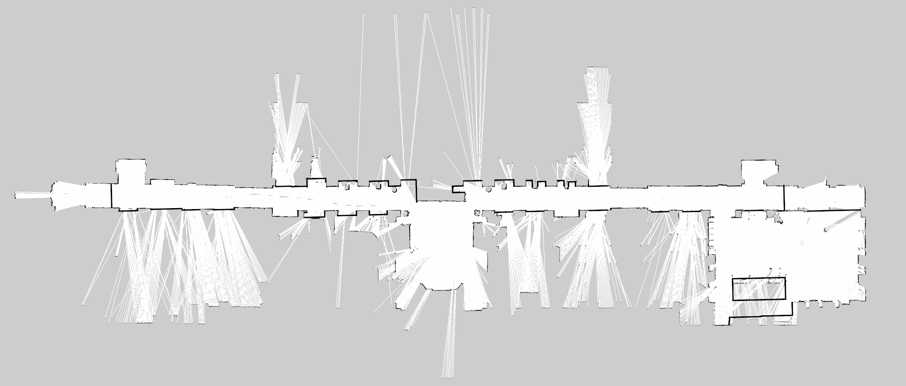

# ROS Workshop - Tutorial 6 - Turtlebot3 Navigation
## ME4140 - Introduction to Robotics, ME6640 - Advanced Robotics 

## Overview:
Applications typically require the mobile robot to visit goal points defined by a top-level planning or controller node. Goals may be sampled from predefined paths or computed in time to achieve the mission. The _Pose Estimate_ and _1D Nav_ buttons in RVIZ used in the previous tutorial are useful for testing but are not suitable for most robotic applications. During operation, the goal points and robot status are accessed programatically with a user defined node.



(Image: TNTech Robotics)
 
 In this tutorial you will learn to publish and subcribe to navigation topics used by Turtlebot3 Simulations with a custom C++ node. Read more here at [some reference](https://wiki.ros.org)

## System Requirements:

- **ROS+OS**: This tutorial is intended for a system with ROS noetic installed on the Ubuntu 20.04 LTS operating system. Alternate versions of ROS (i.e. - Kinetic, Noetic, etc.) may work but have not been tested. Versions of ROS are tied to versions of Ubuntu.
- **ROS**: Your computer must be connected to the internet to proceed. Update the system before you begin.
- **Workspace Setup**: The Turtlebot3 Simulator from tutorial 5 must be operational before completing tutorial 6.  

	
## Before Beginning:

- Complete _Tutorial 6 - Turtlebot Navigation_ before starting this tutorial.	
	

## Part 1 - Create Goal Publisher Node
This node will publish goal point data to the appropriate topic to move the robot. Create the node in the previously used package _tutorial6_ source folder.

```
$ gedit ~/catkin_ws/src/tutorial6/src/publish_goal.cpp
```
Copy the following code into the editor and save the file.
```c++
#include "ros/ros.h"
#include "geometry_msgs/PoseStamped.h"
#include <sstream>
int main(int argc, char **argv)
{
    ros::init(argc, argv, "publish_goal");
    ros::NodeHandle n;
    ros::Publisher ttu_publisher =
    n.advertise<geometry_msgs::PoseStamped>("/move_base_simple/goal", 1000);
    ros::Rate loop_rate(10);
    geometry_msgs::PoseStamped msg;
    msg.header.stamp=ros::Time::now();
    msg.header.frame_id="map";
    
    int count = 0;   
    while ((ros::ok())&&(count<5))
    {
        msg.pose.position.x = 3.0;
        msg.pose.position.y = 2.0;
        msg.pose.position.z = 0;
        msg.pose.orientation.w = 1.0;
        ttu_publisher.publish(msg);
        ros::spinOnce();
        loop_rate.sleep();
        count++;
    }
}
```

Edit the CMakeLists.txt file so the new node can be compiled.

```
gedit ~/catkin_ws/src/tutorial6/CMakeLists.txt
```

Copy the following lines into the bottom of the file and save.

```
add_executable(publish_goal src/publish_goal.cpp)
target_link_libraries(publish_goal ${catkin_LIBRARIES})
```

Move to the top of the workspace and compile to generate an executable from the source code.

```
cd ~/catkin_ws
catkin_make
```

The workspace should compile without errors before continuing.


# Part 2 - Test the Goal Publisher Node

Start the turtlebot3 robot simulation with commands from _Tutorial6 - Turtlebot3 Navigation_

```
roslaunch turtlebot3_gazebo turtlebot3_world.launch
```
In a second terminal, turn on navigation and RVIZ using the custom map
```
roslaunch turtlebot3_navigation turtlebot3_navigation.launch map_file:='$(find tutorial6)\maps\demo_world.yaml'
```

Run the publish goal node in a third terminal.
```
rosrun tutorial6 publish_goal
``` 
The robot should begin planning a path to the goal. If a valid path is found, the robot will begin to move toward the goal.

# Part 3 - Create Status Subscriber Node

Create a new file for the subcriber node source code in the same package 
```
gedit ~/catkin_ws/src/tutorial6/src/subscribe_status.cpp
```
Copy and paste the following code into the file and save

```c++
#include "ros/ros.h"
#include "std_msgs/String.h"
#include "actionlib_msgs/GoalStatusArray.h"

void statusCB(const actionlib_msgs::GoalStatusArray::ConstPtr& msg)
{
    ROS_INFO("Subscriber Callback Executed");
    if (!msg->status_list.empty())
    {
        actionlib_msgs::GoalStatus goalStatus = msg->status_list[0];
        ROS_INFO("Status Recieved: %i",goalStatus.status);
    }
}

int main(int argc, char **argv)
{
    ros::init(argc, argv, "subscribe_status");
    ros::NodeHandle n;
    ros::Subscriber sub = n.subscribe("/move_base/status", 1000, statusCB);
    ros::spin();
    return 0;
}
```
Edit the CMakeLists.txt file so the new node can be compiled.

```
gedit ~/catkin_ws/src/tutorial6/CMakeLists.txt
```

Copy the following lines into the bottom of the file and save.

```
add_executable(subscribe_status src/subscribe_status.cpp)
target_link_libraries(subscribe_status ${catkin_LIBRARIES})
```

Move to the top of the workspace and compile to generate an executable from the source code.

```
cd ~/catkin_ws
catkin_make
```

The workspace should compile without errors before continuing.


# Step 4 - Test Subscribe Status Node
Start the simulator with the same commands as before and run the subscribe_status node. Read about the GoalStatus message [here](https://docs.ros.org/en/noetic/api/actionlib_msgs/html/msg/GoalStatus.html)

```
rosrun tutorial6 subscribe_status
```

The status topic should contain an integer 0-9 indicating one of the following states.

\begin{lstlisting}
GoalID goal_id
uint8 status
uint8 PENDING         = 0   # The goal has yet to be processed by the action server
uint8 ACTIVE          = 1   # The goal is currently being processed by the action server
uint8 PREEMPTED       = 2   # The goal received a cancel request after it started executing
                            #   and has since completed its execution (Terminal State)
uint8 SUCCEEDED       = 3   # The goal was achieved successfully by the action server (Terminal State)
uint8 ABORTED         = 4   # The goal was aborted during execution by the action server due
                            #    to some failure (Terminal State)
uint8 REJECTED        = 5   # The goal was rejected by the action server without being processed,
                            #    because the goal was unattainable or invalid (Terminal State)
uint8 PREEMPTING      = 6   # The goal received a cancel request after it started executing
                            #    and has not yet completed execution
uint8 RECALLING       = 7   # The goal received a cancel request before it started executing,
                            #    but the action server has not yet confirmed that the goal is canceled
uint8 RECALLED        = 8   # The goal received a cancel request before it started executing
                            #    and was successfully cancelled (Terminal State)
uint8 LOST            = 9   # An action client can determine that a goal is LOST. This should not be
                            #    sent over the wire by an action server

#Allow for the user to associate a string with GoalStatus for debugging
string text

\end{lstlisting}


### Tutorial Complete: 
After completing _Tutorial 6B - Turtlebot3 Simulator_, you are ready to learn about ... even more ROS!
	


NOW, YOU KNOW ABOUT ROS! GOOD JOB!
	
	
		
